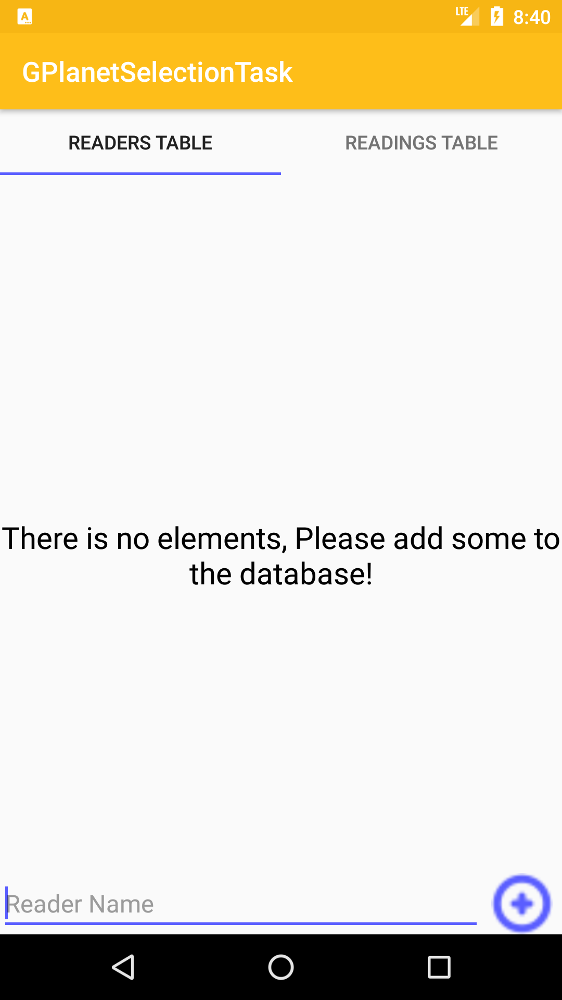

# GPlanetSelectionTask
This is a selection task for GPlanet, that was created with #MVP design pattern and room as a local database.

The Task simply depends on the MVP design pattern, how the presenter manages the comunication between the model(Room DB) and the View(Fragments).
The task is to get the highest readers from a database that has there readings intervals, The highest reader is the one that the number of distict pages is the most.
That's a common problem called overlapping intervals solved in O(n Logn), the solution is inspired from geeksforgeeks(check the references).

Some of the references:

https://www.geeksforgeeks.org/merging-intervals/

http://www.tinmegali.com/en/2016/03/06/model-view-presenter-mvp-in-android-part-2/

https://codelabs.developers.google.com/codelabs/android-room-with-a-view

https://medium.com/@Viraj.Tank/android-mvp-that-survives-view-life-cycle-configuration-internet-changes-part-2-6b1e2b5c5294

RoundedImageClass : https://stackoverflow.com/a/16208548/10240833

# Screens
## 0 - Example of empty tables

## 0 - Example of filled tables

## 3 - Example of the Main Screen

